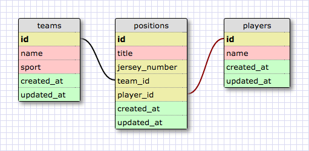

# Part 4: SQL Queries
## Summary
In this part of the assessment you will be working with the provided `directory.sqlite` database to demonstrate your ability to work with data in a relational database. The schema is made up of three tables: `teams`, `players`, and `positions` (see Figure 1).

  
*Figure 1*.  Database schema visualization

To get started open a SQLITE session in the console with the following command (note: assuming in the part-4 directory)

```bash
$ sqlite3 directory.sqlite
```

## Releases
### Release 0: Query the Database
For each question below, write a single SQL query that will answer the question. The query should return only the data that is requested.

Copy each query and its output to the `part-4/queries.md` file.

1. What are all the player names?
2. Which team names include the word "Chicago"?
3. What are the titles of the positions on the team named "Chicago Blackhawks"?
4. What are the names of the teams Shannon Boxx plays for?
5. What are the names of the players who play soccer? (Each name should be listed once; no repeats.)
6. What is the name of the team with the most players, and how many players does it have?


### Release 1: Modify the Database
In each item below, you'll be asked to update the database in someway. You may run multiple statements to make an update. Record any SQL statements that you write to make the updates in the `part-4/queries.md` file.

1. The Chicago Blackhawks, one of the teams in the database, signed a player to play "Center" and wear jersey number 99.  The player's name is "Kevin Solorio".  Update the database to reflect this.
2. The team named "Oakland Raiders" is moving to a new city.  It's new name is "Las Vegas Raiders".  Update the database to reflect this.
3. The player named "Tony Romo" has retired.  Remove this player and their positions from the database.


## Conclusion
You are done with part-4. If you have not committed your changes, please do so before moving onto part-5.
